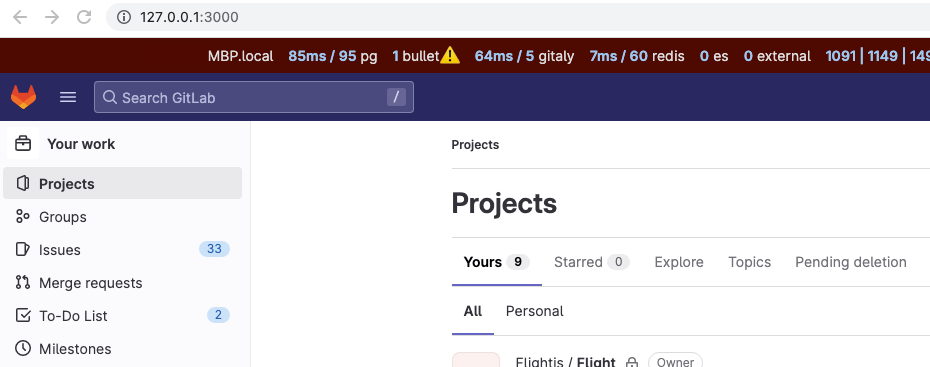

# Configure GDK-in-a-box

If you want to contribute to the GitLab codebase and want a development environment in which to test
your changes, you can use
[GDK-in-a-box](https://gitlab.com/gitlab-org/gitlab-development-kit/-/blob/main/doc/gdk_in_a_box.md),
a virtual machine (VM) pre-configured with [the GitLab Development Kit (GDK)](https://gitlab.com/gitlab-org/gitlab-development-kit).

The GDK is a local development environment that includes an installation of self-managed GitLab,
sample projects, and administrator access with which you can test functionality.

It requires 30 GB of disk space.



If you prefer to use GDK locally without a VM, use the steps in [Install the GDK development environment](configure-dev-env-gdk.md)

## Download GDK-in-a-box

1. Download and install virtualization software to run the virtual machine:
   - Mac computers with [Apple silicon](https://support.apple.com/en-us/116943): [UTM](https://docs.getutm.app/installation/macos/).
     Select **Download from GitHub**.
   - Linux / Windows / Mac computers with Intel silicon: [VirtualBox](https://www.virtualbox.org/wiki/Downloads)
1. Download and unzip GDK-in-a-box. The file is up to 15 GB and might take some time to download:
   - Mac computers with Apple silicon: [UTM image](https://go.gitlab.com/cCHpCP)
   - Linux / Windows / Mac: [VirtualBox image](https://go.gitlab.com/5iydBP)
1. Double-click the virtual machine image to open it:
   - UTM: `gdk.utm`
   - VirtualBox: `gdk.vbox`
1. Continue to **Use VS Code to connect to GDK**.

## Use VS Code to connect to GDK

[View a demo video of this step](https://go.gitlab.com/b54mHb).

NOTE:
You might need to modify the system configuration (CPU cores and RAM) before starting the virtual machine.

1. Start the VM (you can minimize UTM or VirtualBox).
1. In VS Code, select **Terminal > New terminal**, then run a `curl` command to add an SSH key to your local `~/.ssh/config`:

   ```shell
   curl "https://gitlab.com/gitlab-org/gitlab-development-kit/-/raw/main/support/gdk-in-a-box/setup-ssh-key" | bash
   ```

   To learn more about the script, you can examine the
   [`setup-ssh-key` code](https://gitlab.com/gitlab-org/gitlab-development-kit/-/blob/main/support/gdk-in-a-box/setup-ssh-key).

1. In VS Code, install the **Remote - SSH** extension:
   - [VS Code](https://marketplace.visualstudio.com/items?itemName=ms-vscode-remote.remote-ssh)
   - [VSCodium](https://open-vsx.org/extension/jeanp413/open-remote-ssh)
1. Make sure that VS Code has access to the local network (**Privacy & Security > Local Network**).
1. Connect VS Code to the VM:
   - Select **Remote-SSH: Connect to host** from the command palette.
   - Enter the SSH host: `debian@gdk.local`
1. A new VS Code window opens.
   You can close the old window to avoid confusion.
   Complete the remaining steps in the new window.
1. In the VS Code terminal, run a `curl` command to configure Git in the GDK:

   ```shell
   curl "https://gitlab.com/gitlab-org/gitlab-development-kit/-/raw/main/support/gdk-in-a-box/first_time_setup" | bash
   ```

   - Enter your name and email address when prompted.
   - Add the displayed [SSH key to your profile](https://gitlab.com/-/user_settings/ssh_keys).

   To learn more about the script, you can examine the
   [`first_time_setup` code](https://gitlab.com/gitlab-org/gitlab-development-kit/-/blob/main/support/gdk-in-a-box/first_time_setup).

1. In VS Code, select **File > Open folder**, and go to: `/home/debian/gitlab-development-kit/gitlab/`.
1. Open GitLab in your browser: `http://gdk.local:3000`.
1. Sign in with the username `root` and password `5iveL!fe`.
1. Continue to [change the code with the GDK](contribute-gdk.md).

## Shut down GDK

You can select the power icon (**{power}**) to shut down
the virtual machine, or enter the `shutdown` command in the terminal.
Use the password `debian`:

```shell
sudo shutdown now
```

## Update GDK-in-a-box

You can update GDK-in-a-box while connected to `debian@gdk.local` in VS Code.

In the VS Code terminal, enter:

```shell
gdk update
```

## Change the code

After the GDK is ready, continue to [Contribute code with the GDK](contribute-gdk.md).
