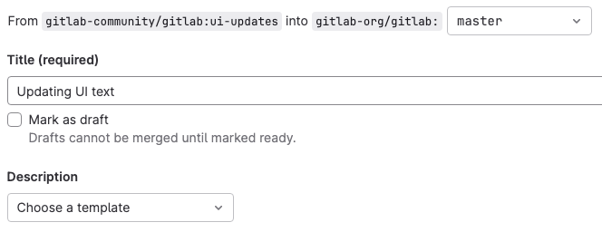
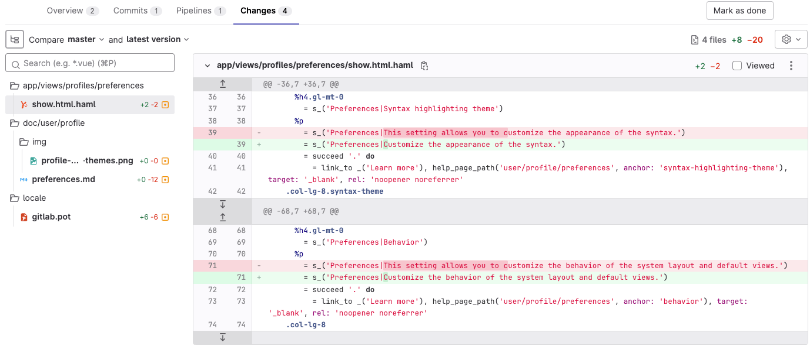

# Create a merge request

Now you're ready to push changes from the community fork to the main GitLab repository!

[View an interactive demo of this step](https://gitlab.navattic.com/tu5n0haw).

1. Go to [the community fork on GitLab.com](https://gitlab.com/gitlab-community/gitlab).
   You should see a message like this one:

   

   Select **Create merge request**.
   If you don't see this message, on the left sidebar, select **Code > Merge requests > New merge request**.

1. Take a look at the branch names. You should be merging from your branch
   in the community fork to the `master` branch in the GitLab repository.

   

1. Fill out the information and then select **Save changes**.
   Don't worry if your merge request is not complete.

   If you don't want anyone from GitLab to review it, you can select the **Mark as draft** checkbox.
   If you're not happy with the merge request after you create it, you can close it, no harm done.

1. Select the **Changes** tab. It should look something like this:

   

   The red text shows the code before you made changes. The green shows what
   the code looks like now.

1. If you're happy with this merge request and want to start the review process, type
   `@gitlab-bot ready` in a comment and then select **Comment**.

   

Someone from GitLab will look at your request and let you know what the next steps are.

## Complete the review process

After you create a merge request, GitLab automatically triggers a [CI/CD pipeline](../../../ci/pipelines/index.md)
that runs tests, linting, security scans, and more.

Your pipeline must be successful for your merge request to be merged.

- To check the status of your pipeline, at the top of your merge request, select **Pipelines**.
- If you need help understanding or fixing the pipeline, in a comment, use the `@gitlab-bot help` command.

### Getting a review

GitLab will triage your merge request automatically.
However, you can type `@gitlab-bot ready` in a comment to alert reviewers that your MR is ready.

- When the label is set to `workflow::ready for review`, [a developer reviews the MR](../../code_review.md).
- After you have resolved all of their feedback and the MR has been approved, the MR is ready for merge.

If you need help at any point in the process, type `@gitlab-bot help` in a comment or initiate a
[mentor session](https://about.gitlab.com/community/contribute/mentor-sessions/) on [Discord](https://discord.com/invite/gitlab).

When the merge request is merged, your change becomes part of the GitLab codebase.
Great job! Thank you for your contribution!
