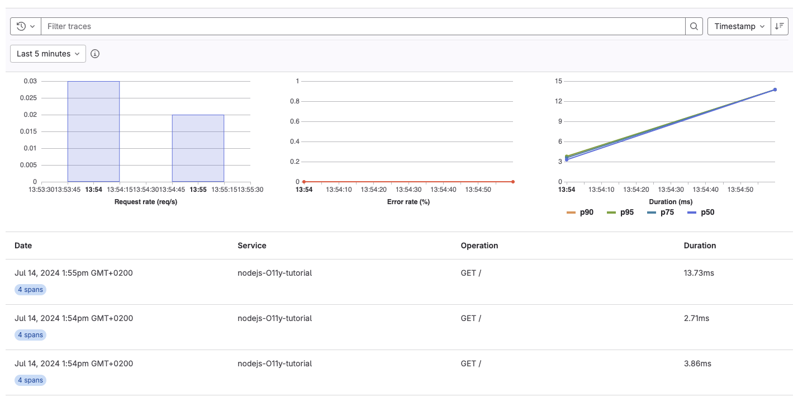
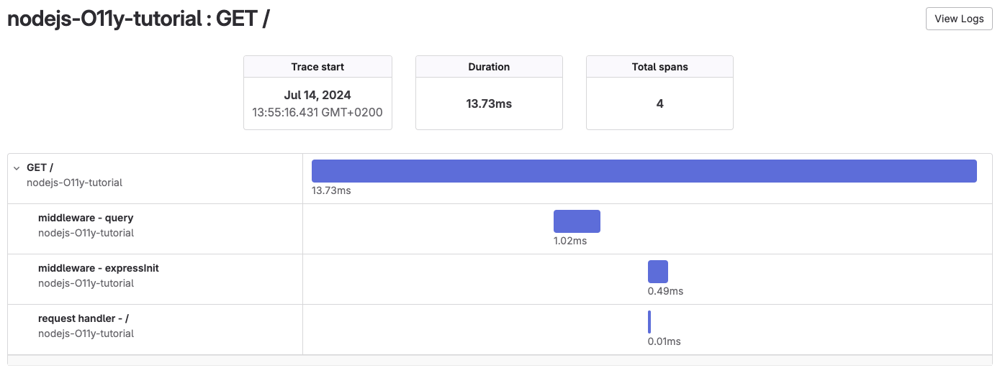

# Tutorial: Use GitLab Observability with a NodeJS application

FLAG:
The availability of this feature is controlled by a feature flag.
For more information, see the history of the [**Distributed tracing** feature](../../development/tracing.md).
<!-- Update this note when observability_features flag is removed -->

In this tutorial, you'll learn how to configure, instrument, and monitor a NodeJS application using GitLab Observability features.

## Before you begin

Take a moment and make sure you have the following:

- A GitLab Ultimate subscription for GitLab.com or GitLab self-managed
- A local installation of NodeJS
- Basic knowledge of Git, NodeJS, JavaScript, and the core concepts of [OpenTelemetry](https://opentelemetry.io/)

## Create a new GitLab project

First, create a new GitLab project and a corresponding access token.
This tutorial uses the project name `nodejs-O11y-tutorial`.

1. On the left sidebar, at the top, select **Create new** (**{plus}**) and **New project/repository**.
1. Select **Create from template**.
1. Select **Use template** for NodeJS Express.
1. Enter the project details.
   - In the **Project name** field, enter `nodejs-O11y-tutorial`.
1. Select **Create project**.
1. In the `nodejs-O11y-tutorial` project, on the left sidebar, select **Settings > Access tokens**.
1. Create an access token with the `api` scope and Developer role. Store the token value somewhere safe—you'll need it later.

## Instrument your NodeJS application

Next, we need to instrument the NodeJS application.

1. Ensure you have [NodeJS](https://nodejs.org/en) installed by running the following:

   ```shell
   node -v
   ```

1. Clone the `nodejs-O11y-tutorial` project and `cd` to the `nodejs-O11y-tutorial` directory.
1. Install the dependencies by running:

   ```shell
   npm install
   ```

1. Run the application:

   ```shell
   PORT=8080 node server.js
   ```

1. In a web browser, visit `http://localhost:8080` and make sure the application is running correctly.
1. Add the OpenTelemetry packages:

   ```shell
   npm install --save @opentelemetry/api \
     @opentelemetry/auto-instrumentations-node
   ```

1. Find your project ID:
   1. On the `nodejs-O11y-tutorial` project overview page, in the upper-right corner, select **Actions** (**{ellipsis_v}**).
   1. Select **Copy project ID**. Save the copied ID for later.

1. Configure and run your project with instrumentation:

   ```shell
   env OTEL_TRACES_EXPORTER="otlphttp" \
   OTEL_EXPORTER_OTLP_ENDPOINT="https://gitlab.com/api/v4/projects/{{PROJECT_ID}}/observability" \
   OTEL_EXPORTER_OTLP_HEADERS="PRIVATE-TOKEN={{ACCESS_TOKEN}}" \
   OTEL_SERVICE_NAME="nodejs-O11y-tutorial" \
   OTEL_LOG_LEVEL="debug" \
   NODE_OPTIONS="--require @opentelemetry/auto-instrumentations-node/register" \
   PORT=8080 node server.js
   ```

   Be sure to replace the `PROJECT_ID`, and `ACCESS_TOKEN` with the values you obtained earlier.
   If using GitLab Self-Managed, replace `gitlab.com` with your self-managed instance hostname.

## View traces

Now that you have an application configured to use Observability tracing,
you can view exported traces on GitLab.com.

To view exported traces:

1. Start the `nodejs-O11y-tutorial` application with instrumentation again.
1. Visit `http://localhost:8080/` and perform some actions in the application.
1. In the `nodejs-O11y-tutorial` project, on the left sidebar, select **Monitor > Traces**.
   If everything is working correctly, you should see a trace for each request.

   

1. Optional. Select a trace to view its span.

   

Congratulations! You successfully created an application, configured it to use GitLab Observability features, and examined the traces the application created. You can continue to experiment with this application, or try configuring a more complex application to export traces.

Remember that Observability Tracing is not yet ready for production use. There is no official support for logs or metrics using the OpenTelemetry collector with a NodeJS application.
