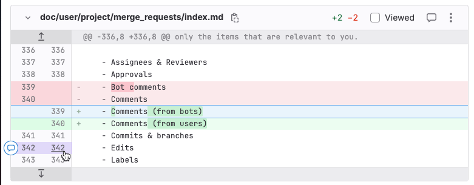
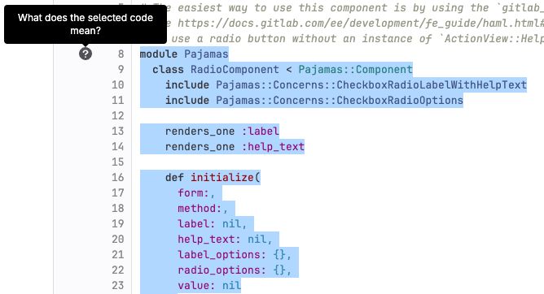
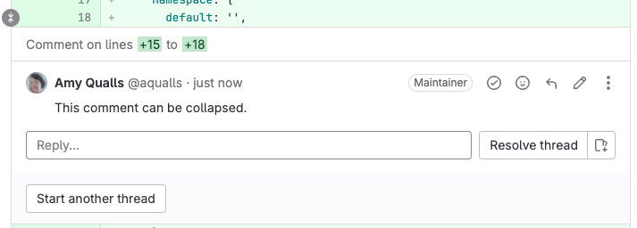

# Changes in merge requests

DETAILS:
**Tier:** Free, Premium, Ultimate
**Offering:** GitLab.com, Self-managed, GitLab Dedicated

A [merge request](index.md) proposes a set of changes to files in a branch in your repository. GitLab
shows these changes as a _diff_ (difference) between the current state and the proposed
changes. By default, the diff compares your proposed changes (the source branch) with
the target branch. By default, GitLab shows only the changed portions of the files.

This example shows changes to a text file. In the default syntax highlighting theme:

- The _current_ version is shown in red, with a minus (`-`) sign before the line.
- The _proposed_ version is shown in green with a plus (`+`) sign before the line.



The header for each file in the diff contains:

- **Hide file contents** (**{chevron-down}**) to hide all changes to this file.
- **Path**: The full path to this file. To copy this path, select
  **Copy file path** (**{copy-to-clipboard}**).
- **Lines changed**: The number of lines added and deleted in this file, in the format `+2 -2`.
- **Viewed**: Select this checkbox to [mark the file as viewed](#mark-files-as-viewed)
  until it changes again.
- **Comment on this file** (**{comment}**) to leave a general comment on the file, without
  pinning the comment to a specific line.
- **Options**: Select (**{ellipsis_v}**) to display more file viewing options.

The diff also includes navigation and comment aids to the left of the file, in the gutter:

- **Show more context**: Select **Previous 20 lines** (**{expand-up}**) to display
  the previous 20 unchanged lines, or **Next 20 lines** (**{expand-down}**) to
  show the next 20 unchanged lines.
- **Line numbers** are shown in two columns. Previous line numbers are shown on
  the left, and proposed line numbers on the right. To interact with a line:
  - To show [comment options](#add-a-comment-to-a-merge-request-file), hover over a line number.
  - To copy a link to the line, press <kbd>Command</kbd> and select (or right-click)
    a line number, then select **Copy link address**.
  - To highlight a line, select the line number.

## Show a list of changed files

Use the **file browser** to view a list of files changed in a merge request:

1. On the left sidebar, select **Search or go to** and find your project.
1. Select **Code > Merge requests** and find your merge request.
1. Below the merge request title, select **Changes**.
1. Select **Show file browser** (**{file-tree}**) or press <kbd>F</kbd> to show
   the file tree.
   - For a tree view that shows nesting, select **Tree view** (**{file-tree}**).
   - For a file list without nesting, select **List view** (**{list-bulleted}**).

## Show all changes in a merge request

To view the diff of changes included in a merge request:

1. On the left sidebar, select **Search or go to** and find your project.
1. Select **Code > Merge requests** and find your merge request.
1. Below the merge request title, select **Changes**.
1. If the merge request changes many files, you can jump directly to a specific file:
   1. Select **Show file browser** (**{file-tree}**) or press <kbd>F</kbd> to show the file tree.
   1. Select the file you want to view.
   1. To hide the file browser, select **Show file browser** or press <kbd>F</kbd> again.

GitLab collapses files with many changes to improve performance, and displays the message:
**Some changes are not shown**. To view the changes for that file, select **Expand file**.

### Show a linked file first

DETAILS:
**Tier:** Free, Premium, Ultimate
**Offering:** GitLab.com

> - [Introduced](https://gitlab.com/gitlab-org/gitlab/-/issues/387246) in GitLab 16.9 [with a flag](../../../administration/feature_flags.md) named `pinned_file`. Disabled by default.
> - [Generally available](https://gitlab.com/gitlab-org/gitlab/-/merge_requests/162503) in GitLab 17.4. Feature flag `pinned_file` removed.

When you share a merge request link with a team member, you might want to show a specific file
first in the list of changed files. To copy a merge request link that shows your desired file first:

1. On the left sidebar, select **Search or go to** and find your project.
1. Select **Code > Merge requests** and find your merge request.
1. Below the merge request title, select **Changes**.
1. Find the file you want to show first. Right-click the name of the file to copy the link to it.
1. When you visit that link, your chosen file is shown at the top of the list. The file browser
   shows a link icon (**{link}**) next to the file name:

   

## Collapse generated files

DETAILS:
**Tier:** Free, Premium, Ultimate
**Offering:** GitLab.com, Self-managed, GitLab Dedicated

> - [Introduced](https://gitlab.com/gitlab-org/gitlab/-/merge_requests/140180) in GitLab 16.8 [with a flag](../../../administration/feature_flags.md) named `collapse_generated_diff_files`. Disabled by default.
> - [Enabled on GitLab.com and self-managed](https://gitlab.com/gitlab-org/gitlab/-/merge_requests/145100) in GitLab 16.10.
> - `generated_file` [generally available](https://gitlab.com/gitlab-org/gitlab/-/merge_requests/148478) in GitLab 16.11. Feature flag `collapse_generated_diff_files` removed.

To help reviewers focus on the files needed to perform a code review, GitLab collapses
several common types of generated files. GitLab collapses these files by default, because
they rarely require code reviews:

1. Files with `.nib`, `.xcworkspacedata`, or `.xcurserstate` extensions.
1. Package lock files such as `package-lock.json` or `Gopkg.lock`.
1. Files in the `node_modules` folder.
1. Minified `js` or `css` files.
1. Source map reference files.
1. Generated Go files, including the generated files by protocol buffer compiler.

To mark a file or path as generated, set the `gitlab-generated` attribute for it
in your [`.gitattributes` file](../repository/files/git_attributes.md).

### View a collapsed file

1. On the left sidebar, select **Search or go to** and find your project.
1. Select **Code > Merge requests** and find your merge request.
1. Below the merge request title, select **Changes**.
1. Find the file you want to view, and select **Expand file**.

### Configure collapse behavior for a file type

To change the default collapse behavior for a file type:

1. If a `.gitattributes` file does not exist in the root directory of your project,
   create a blank file with this name.
1. For each file type you want to modify, add a line to the `.gitattributes` file
   declaring the file extension and your desired behavior:

   ```conf
   # Collapse all files with a .txt extension
   *.txt gitlab-generated

   # Collapse all files within the docs directory
   docs/** gitlab-generated

   # Do not collapse package-lock.json
   package-lock.json -gitlab-generated
   ```

1. Commit, push, and merge your changes into your default branch.

After the changes merge into your [default branch](../repository/branches/default.md),
all files of this type in your project use this behavior in merge requests.

For technical details about how GitLab detects generated files, see the
[`go-enry`](https://github.com/go-enry/go-enry/blob/master/data/generated.go) repository.

## Show one file at a time

For larger merge requests, you can review one file at a time. You can change this
setting in your user preferences, or when you review a merge request. If you change this
setting in a merge request, it updates your user settings as well.

::Tabs

:::TabTitle In a merge request

1. On the left sidebar, select **Search or go to** and find your project.
1. Select **Code > Merge requests** and find your merge request.
1. Below the merge request title, select **Changes**.
1. Select **Preferences** (**{preferences}**).
1. Select or clear **Show one file at a time**.

:::TabTitle In your user preferences

1. On the left sidebar, select your avatar.
1. Select **Preferences**.
1. Scroll to the **Behavior** section and select the **Show one file at a time on merge request's Changes tab** checkbox.
1. Select **Save changes**.

::EndTabs

To select another file to view when this setting is enabled, either:

- Scroll to the end of the file and select either **Prev** or **Next**.
- If [keyboard shortcuts are enabled](../../shortcuts.md#enable-keyboard-shortcuts),
  press <kbd>&#91;</kbd>, <kbd>]</kbd>, <kbd>k</kbd>, or <kbd>j</kbd>.
- Select **Show file browser** (**{file-tree}**) and select another file to view.

## Compare changes

You can view the changes in a merge request either:

- Inline, which shows the changes vertically. The old version of a line is shown
  first, with the new version shown directly below it.
  Inline mode is often better for changes to single lines.
- Side-by-side, which shows the old and new versions of lines in separate columns.
  Side-by-side mode is often better for changes affecting large numbers of sequential lines.

To change how a merge request shows changed lines:

1. On the left sidebar, select **Search or go to** and find your project.
1. Select **Code > Merge requests** and find your merge request.
1. Below the title, select **Changes**.
1. Select **Preferences** (**{preferences}**). Select either **Side-by-side** or **Inline**.
   This example shows how GitLab renders the same change in both inline and side-by-side mode:

   ::Tabs

   :::TabTitle Inline changes

   

   :::TabTitle Side-by-side changes

   

   ::EndTabs

## Explain code in a merge request

DETAILS:
**Tier:** Premium with GitLab Duo Pro, Ultimate with GitLab Duo Pro or Enterprise - [Start a trial](https://about.gitlab.com/solutions/gitlab-duo-pro/sales/?type=free-trial)
**Offering:** GitLab.com, Self-managed, GitLab Dedicated
**LLM:** Anthropic [Claude 3.5 Sonnet](https://console.cloud.google.com/vertex-ai/publishers/anthropic/model-garden/claude-3-5-sonnet)

> - Introduced in GitLab 15.11 as an [experiment](../../../policy/development_stages_support.md#experiment) on GitLab.com.
> - [Generally available](https://gitlab.com/gitlab-org/gitlab/-/issues/429915) in GitLab 16.8.
> - Changed to require GitLab Duo add-on in GitLab 17.6 and later.

If you spend a lot of time trying to understand code that others have created, or
you struggle to understand code written in a language you are not familiar with,
you can ask GitLab Duo to explain the code to you.

Prerequisites:

- You must belong to at least one group with the
  [experiment and beta features setting](../../../user/gitlab_duo/turn_on_off.md#turn-on-beta-and-experimental-features) enabled.
- You must have access to view the project.

To explain the code in a merge request:

1. On the left sidebar, select **Search or go to** and find your project.
1. Select **Code > Merge requests**, then select your merge request.
1. Select **Changes**.
1. On the file you would like explained, select the three dots (**{ellipsis_v}**) and select **View File @ $SHA**.

   A separate browser tab opens and shows the full file with the latest changes.

1. On the new tab, select the lines you want to have explained.
1. On the left side, select the question mark (**{question}**). You might have to scroll to the first line of your selection to view it.

   

Duo Chat explains the code. It might take a moment for the explanation to be generated.

If you'd like, you can provide feedback about the quality of the explanation.

We cannot guarantee that the large language model produces results that are correct. Use the explanation with caution.

You can also explain code in:

- A [file](../../../user/project/repository/code_explain.md).
- The [IDE](../../../user/gitlab_duo_chat/examples.md#explain-selected-code).

## Expand or collapse comments

When reviewing code changes, you can hide inline comments:

1. On the left sidebar, select **Search or go to** and find your project.
1. Select **Code > Merge requests** and find your merge request.
1. Below the title, select **Changes**.
1. Scroll to the file that contains the comments you want to hide.
1. Scroll to the line the comment is attached to, and select **Collapse** (**{collapse}**):
   

To expand inline comments and show them again:

1. On the left sidebar, select **Search or go to** and find your project.
1. Select **Code > Merge requests** and find your merge request.
1. Below the title, select **Changes**.
1. Scroll to the file that contains the collapsed comments you want to show.
1. Scroll to the line the comment is attached to, and select the user avatar:
   

## Ignore whitespace changes

Whitespace changes can make it more difficult to see the substantive changes in
a merge request. You can choose to hide or show whitespace changes:

1. On the left sidebar, select **Search or go to** and find your project.
1. Select **Code > Merge requests** and find your merge request.
1. Below the title, select **Changes**.
1. Before the list of changed files, select **Preferences** (**{preferences}**).
1. Select or clear **Show whitespace changes**:

   

## Mark files as viewed

When reviewing a merge request with many files multiple times, you can ignore files
you've already reviewed. To hide files that haven't changed since your last review:

1. On the left sidebar, select **Search or go to** and find your project.
1. Select **Code > Merge requests** and find your merge request.
1. Below the title, select **Changes**.
1. In the file's header, select the **Viewed** checkbox.

Files marked as viewed are not shown to you again unless either:

- The contents of the file change.
- You clear the **Viewed** checkbox.

## Show merge request conflicts in diff

> - [Enabled on GitLab.com and self-managed](https://gitlab.com/gitlab-org/gitlab/-/issues/276918) in GitLab 15.7.
> - [Generally available](https://gitlab.com/gitlab-org/gitlab/-/issues/276918) in GitLab 15.8. Feature flag `display_merge_conflicts_in_diff` removed.

To avoid displaying changes already on target branch, we compare the merge request's
source branch with the `HEAD` of the target branch.

When the source and target branch conflict, we show an alert
per conflicted file on the merge request diff:


## Show scanner findings in diff

DETAILS:
**Tier:** Ultimate
**Offering:** GitLab.com, Self-managed, GitLab Dedicated

You can show scanner findings in the diff. For details, see:

- [Code Quality findings](../../../ci/testing/code_quality.md#merge-request-changes-view)
- [Static Analysis findings](../../application_security/sast/index.md#merge-request-changes-view)

## Add a comment to a merge request file

> - [Introduced](https://gitlab.com/gitlab-org/gitlab/-/merge_requests/123515) in GitLab 16.1 [with a flag](../../../administration/feature_flags.md) named `comment_on_files`. Enabled by default.
> - [Feature flag removed](https://gitlab.com/gitlab-org/gitlab/-/merge_requests/125130) in GitLab 16.2.

You can add comments to a merge request diff file. These comments persist across
rebases and file changes.

To add a comment to a merge request file:

1. On the left sidebar, select **Search or go to** and find your project.
1. Select **Code > Merge requests** and find your merge request.
1. Select **Changes**.
1. In the header for the file you want to comment on, select **Comment** (**{comment}**).

## Add a comment to an image

In merge requests and commit detail views, you can add a comment to an image.
This comment can also be a thread.

1. Hover your mouse over the image.
1. Select the location where you want to comment.

GitLab shows an icon and a comment field on the image.

## Resources

- For technical details on how GitLab calculates the diff between the two revisions,
  see [Working with diffs](../../../development/merge_request_concepts/diffs/index.md).
